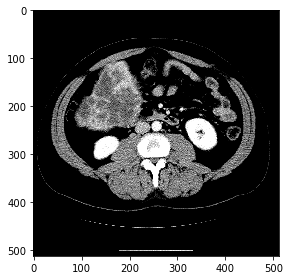
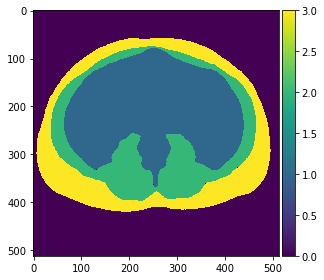
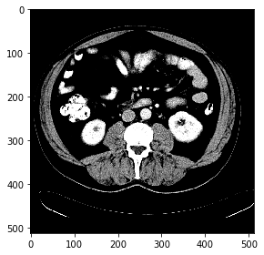
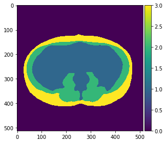
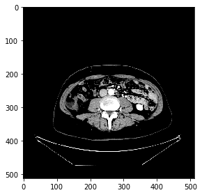
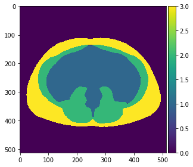

# UEfficientNetB7 
MOAI 2020 Body Morphometry AI Segmentation Online Challenge - 5th Solution
## Content
- [Network Structure](#network-structure)
- [Getting Started](#getting-tarted)
- [References](#references)

## Network Structure
This work used Unet with EfficientNetB7 as the backbone. Nothing was specially designed, I just follow the code provided by Segmentation [Models](https://segmentation-models.readthedocs.io/en/latest/api.html#linknet)

## Getting Started

- Clone the repository

### Prerequisites
- Segmentation Model
- Tensorflow
- Python 3.6+
- Keras 2.3.0
- PIL
- numpy

```python
pip install -r requirements.txt
```

## Running
### Training 
- Preprocess
    - Download the [data](https://drive.google.com/file/d/1ji0D1r71jLMl8qoGgx2X03BXHLqHPEKw/view?usp=sharing) 
    - Follow steps in the [notebook](https://github.com/tuvovan/Unet-with-EfficientnetB7-Backbone/blob/master/Body%20Morphometry.ipynb) to train, predict and post-process the outputs.

#### Result
Input            |  Predicted Output
:---------------:|:------------------:
  |  
  |  
  |  

## License

This project is licensed under the MIT License - see the [LICENSE](https://github.com/tuvovan/ANL-HDRI/blob/master/LICENSE) file for details

## References
[1] MOAI 2020 Body Morphometry AI Segmentation Online Challenge - [link](https://www.kaggle.com/c/body-morphometry-for-sarcopenia/data)

[2] Segmentation Models - [link](https://segmentation-models.readthedocs.io/en/latest/api.html#linknet)

[3] Nested Unet - Unet++ - [link](https://arxiv.org/abs/1807.10165)

## Acknowledgments
- Any ideas on updating or misunderstanding, please send me an email: <vovantu.hust@gmail.com>
- If you find this repo helpful, kindly give me a star.

